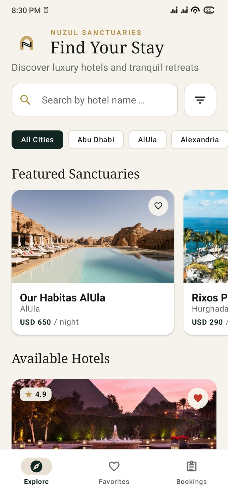
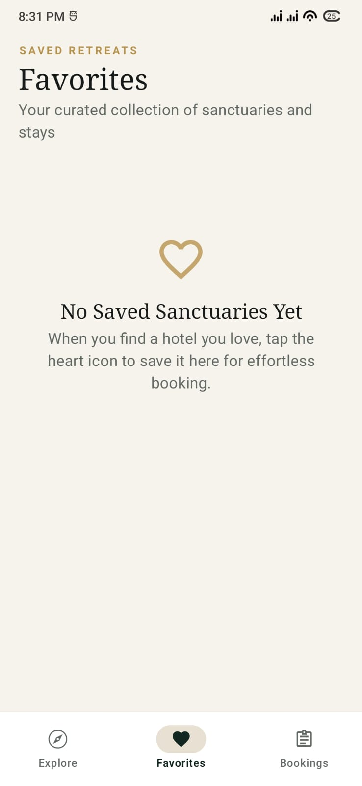
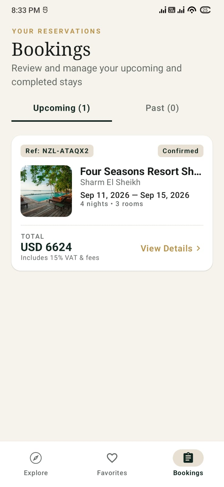
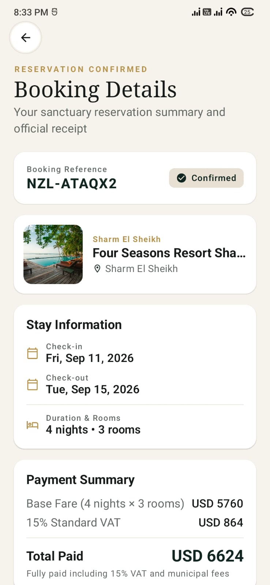
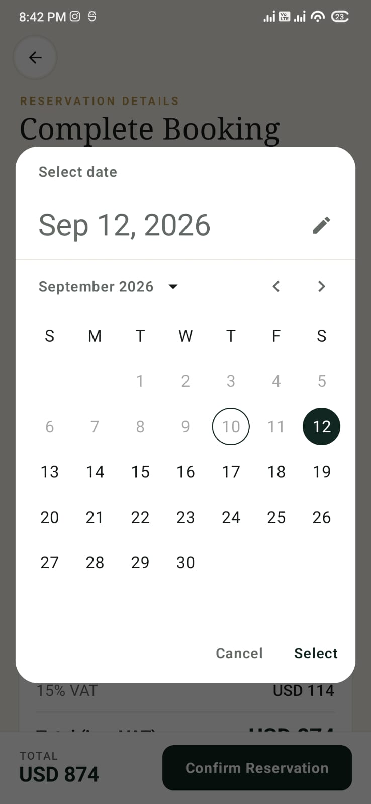
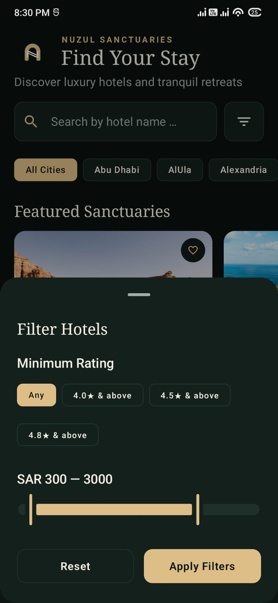
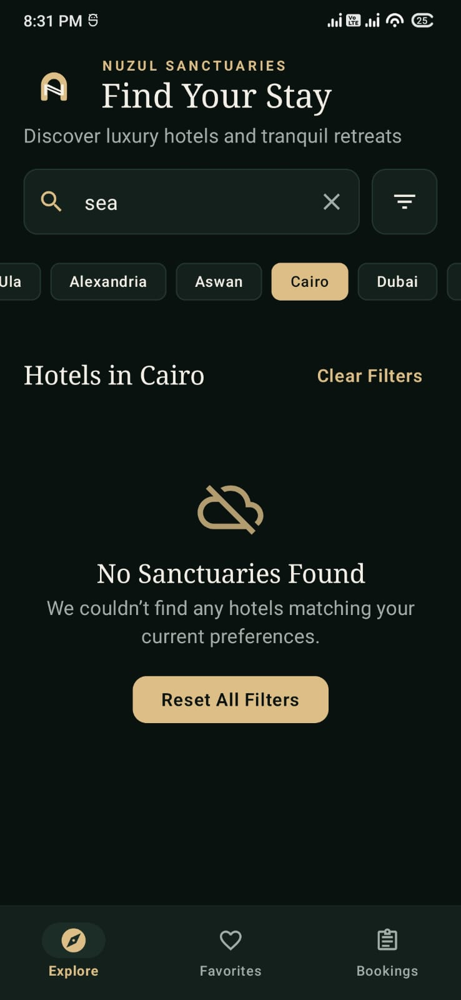
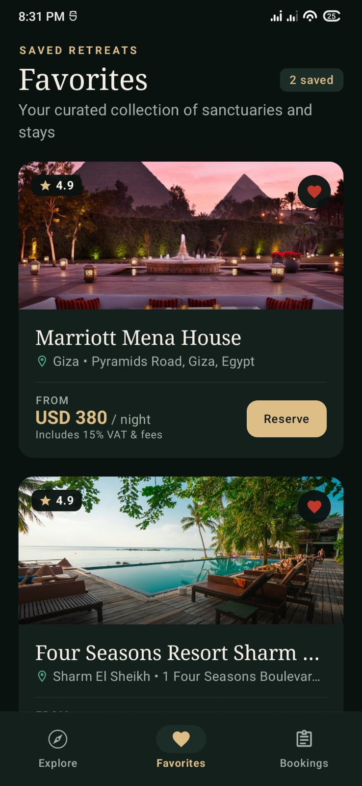
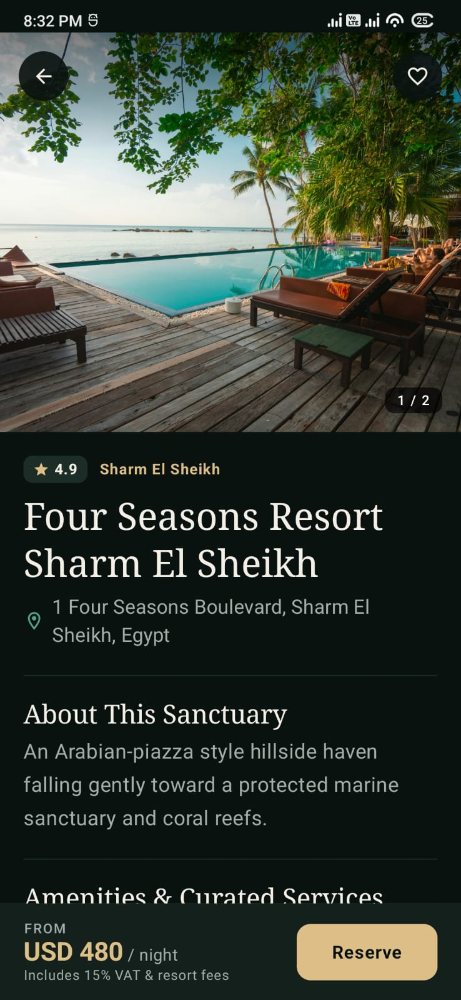
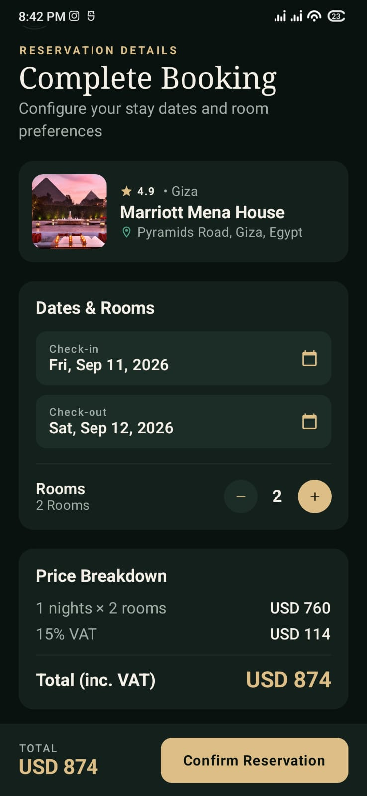

# Nuzul (نُزُل) — Luxury Hotel Explorer & Booking App

[](https://www.android.com/)
[](https://kotlinlang.org/)
[](https://developer.android.com/jetpack/compose)
[](https://developer.android.com/guide/navigation)
[](https://dagger.dev/hilt/)
[](https://developer.android.com/training/data-storage/room)

**Nuzul** (*Arabic: "lodging" / "sanctuary"*) is a native Android hotel browsing and reservation app built with **Clean Architecture**, **MVI/MVVM**, and **Jetpack Compose (Material 3)**. It implements an editorial **"Quiet Luxury"** design language tailored for high-end resort retreats and city sanctuaries.

---

### Screenshots

| Explore                                                       | Favorites                                                             | Bookings                                                       | Booking Details                                                       | Booking Calendar                                                       |
|:-------------------------------------------------------------:|:---------------------------------------------------------------------:|:--------------------------------------------------------------:|:---------------------------------------------------------------------:|:----------------------------------------------------------------------:|
|  |  |  |  |  |

| Filter Hotels                                                      | Search Empty                                                      | Favorites                                                      | Hotel Details                                                      | Booking                                                      |
|:------------------------------------------------------------------:|:-----------------------------------------------------------------:|:--------------------------------------------------------------:|:------------------------------------------------------------------:|:------------------------------------------------------------:|
|  |  |  |  |  |

---

## 🎯 App Scope

* **Explore**: Paginated catalog, featured sanctuaries carousel, hotel search with 350ms debounce, dynamic city chips, continuous price slider, rating filters, and pull-to-refresh.
* **Hotel Details**: Hero photo gallery with page indicator, editorial serif typography, amenities list, location details, interactive favorite toggle, and a sticky reservation bar.
* **Booking Simulation**: Calendar date pickers, room count stepper, validation engine (rejects past dates or checkout on/before checkin), high-precision 15% VAT and total calculations, and confirmation dialog.
* **Bookings**: Automated partitioning into **Upcoming** vs. **Past** stays, persistent reference generator (`NZL-XXXXXX`), and itemized receipts.
* **Favorites**: Dedicated saved retreats screen with real-time cross-screen synchronization.
* **Offline-First**: Single Source of Truth caching with Room, protected cache eviction, and cache status indicators.
* **Out of Scope (By Design)**: Authentication, payment gateways, map SDKs, and push notifications.

---

## 🏛️ Architecture & Key Decisions

```
┌────────────────────────────────────────────────────────────────────────┐
│                          PRESENTATION LAYER                            │
│    Jetpack Compose  •  Material 3  •  Navigation 3  •  MVI / MVVM      │
└────────────────────────────────────┬───────────────────────────────────┘
                                     │ Uses / Observes
                                     ▼
┌────────────────────────────────────────────────────────────────────────┐
│                             DOMAIN LAYER                               │
│     Pure Kotlin  •  Entities  •  Repository Interfaces  •  Use Cases   │
└────────────────────────────────────▲───────────────────────────────────┘
                                     │ Implements
                                     │
┌────────────────────────────────────────────────────────────────────────┐
│                              DATA LAYER                                │
│   Room Database  •  Mock Asset JSON DataSource  •  Repository Impls    │
└────────────────────────────────────────────────────────────────────────┘
```

1. **Targeted State Management**:
  * **MVI (`Explore`, `Booking`)**: Unidirectional intent pipelines prevent race conditions on complex screens with search debounce, sliders, date pickers, and room steppers.
  * **Reactive MVVM (`Favorites`, `Bookings`, `BookingDetails`)**: Lightweight stream observers for read-only lists and entity details.
2. **Navigation 3 with a Single Root Scaffold**:
  * One global `NuzulScaffold` hosts `NuzulNavDisplay`, eliminating nested scaffold bugs and double-padding issues on 3-button navigation devices.
  * Flat backstack ensures `Explore` is always root. Confirming a booking atomically resets the backstack to `[Explore, Bookings, BookingDetails]`, meaning pressing back on a receipt pops directly to the `Bookings` list.
3. **Data Layer Streamlining**:
  * **Direct DAO Injection**: Room DAOs are injected directly into Repositories, removing redundant 1:1 pass-through wrapper layers.
  * **Featured Junction Table**: Featured hotels are stored in a dedicated `featured_hotels (hotelId PK, displayOrder INT)` table and linked via SQL `INNER JOIN`, preventing pagination leaks where featured items might be missing from page 1.
4. **Live Favorites Synchronization**:
  * The UI updates optimistically (0ms response).
  * `ExploreViewModel` observes `getFavoriteHotelsUseCase()`, automatically synchronizing favorite states when toggled in Details or removed in Favorites.
5. **Deterministic Financial Math**:
  * Calculations for base price, 15% VAT, and totals strictly use `BigDecimal` with `RoundingMode.HALF_UP` to prevent floating-point rounding errors.

---

## 🎨 Design System: "Quiet Luxury"

The visual language balances editorial warmth with native Material 3 design tokens:

### Palette

| Token                  | Hex       | Role                                                 |
|:---------------------- |:--------- |:---------------------------------------------------- |
| **Dark Oil Noir**      | `#0A1210` | Deep inky oil-green background for Dark theme        |
| **Deep Olive Forest**  | `#13201C` | Rich dark olive for cards and containers             |
| **Elevated Canopy**    | `#1C2C27` | Surface variant, chip containers, and sheet surfaces |
| **Radiant Gold**       | `#DDBE86` | Primary action buttons (Dark) & rating stars         |
| **Vivid Mineral Jade** | `#4EA388` | Coastal accent & secondary icons                     |
| **Imperial Evergreen** | `#112620` | Deep pine primary tone for Light theme               |
| **Warm Alabaster**     | `#F6F3EC` | Warm linen background for Light theme                |
| **Soft Travertine**    | `#E8E0D2` | Surface variant & active tab indicators              |
| **Pure Silk White**    | `#FFFFFF` | Light theme card background                          |

### Typography & Layout

* **Noto Serif**: Display titles and hotel names (`displayMedium`, `headlineSmall`).
* **Noto Sans**: Functional UI, price values, dates, and navigation labels.
* **Baseline Alignment**: Prices and subtext (e.g., `SAR 1,150` and `/ night`) use `Modifier.alignByBaseline()` for typographic precision.

---

## 🔄 Cache Policy & Invalidation

* **Read Path**: All screens observe local Room SQLite tables as the single source of truth.
* **Sync Path**: On launch or pull-to-refresh, `HotelsRepository.refreshHotels()` updates Room via a database `@Transaction`.
* **Safe Eviction**: Stale search caches are safely deleted without breaking foreign references:

  ```sql
  DELETE FROM hotels 
  WHERE id NOT IN (SELECT hotelId FROM favorites)
     AND id NOT IN (SELECT hotelId FROM featured_hotels)
     AND id NOT IN (SELECT hotelId FROM bookings)
  ```

  **Favorited, featured, and booked hotels are permanently protected from deletion.**

---

## 📁 Project Structure

```text
com.winsome.nuzul/
 ├── NuzulApp.kt
 │
 ├── data/
 │    ├── local/
 │    │    ├── converter/ (Converters.kt)
 │    │    ├── dao/ (BookingDao, FavoriteDao, HotelDao)
 │    │    ├── entity/ (BookingEntity, FavoriteEntity, etc.)
 │    │    └── NuzulDatabase.kt
 │    ├── mapper/ (BookingMapper, HotelMapper)
 │    ├── remote/ (HotelsDataSource, HotelsResponse, MockHotelsDataSource)
 │    └── repository/ (BookingsRepositoryImpl, FavoritesRepositoryImpl, HotelsRepositoryImpl)
 │
 ├── domain/
 │    ├── model/ (Booking, Hotel, HotelFilter, Location, Money)
 │    ├── repository/ (BookingsRepository, FavoritesRepository, HotelsRepository)
 │    ├── usecase/
 │    │    ├── bookings/ (CalculateBookingPricingUseCase, CreateBookingUseCase, etc.)
 │    │    ├── favorites/ (GetFavoriteHotelsUseCase, ToggleFavoriteUseCase)
 │    │    └── hotels/ (GetCitiesUseCase, GetFeaturedHotelsUseCase, etc.)
 │    └── util/ (BookingCalculationEngine, BookingDateValidator, BookingReferenceGenerator)
 │
 ├── presentation/
 │    ├── MainActivity.kt
 │    ├── screen/
 │    │    ├── booking/ (BookingScreen, BookingUiState, BookingViewModel)
 │    │    ├── bookings/ (BookingDetailsScreen, BookingDetailsUiState, BookingDetailsViewModel, etc.)
 │    │    ├── explore/ (ExploreScreen, ExploreUiState, ExploreViewModel)
 │    │    ├── favorites/ (FavoritesScreen, FavoritesUiState, FavoritesViewModel)
 │    │    └── hotel/ (HotelDetailsScreen, HotelDetailsUiState, HotelDetailsViewModel)
 │    └── ui/
 │         ├── component/ (BookingCard, CityFilterRow, etc.)
 │         ├── navigation/ (NuzulNavDisplay, Route)
 │         ├── scaffold/ (NuzulBottomBar, NuzulScaffold)
 │         └── theme/ (Color, Shape, Theme, Type)
 │
 └── di/ (AppModule, DataSourceModule, RepositoryModule)
```

---

## 🛠️ Tech Stack

* **Language**: Kotlin `2.4.20`
* **UI Toolkit**: Jetpack Compose (Material 3)
* **Architecture**: Clean Architecture + MVI / Reactive MVVM
* **Navigation**: Jetpack Navigation 3 (`androidx.navigation3`)
* **Dependency Injection**: Dagger Hilt `2.60.1` (via KSP)
* **Local Storage**: Room `2.8.5`
* **Image Loading**: Coil `2.7.0`
* **Serialization**: Kotlinx Serialization JSON `1.11.0`
* **Asynchrony**: Kotlin Coroutines & Flow

---

## 🤖 AI Usage Statement

* **Tools Used**: Large Language Models were used for architectural brainstorming, boilerplate generation (DTOs and UI states), and theme token refinement.
* **Review Process**: All code was manually verified, refactored, and adapted to adhere strictly to Clean Architecture boundaries, exact Material 3 tokens, Compose baseline alignment rules, and Navigation 3 backstack lifecycles.

---

## ⚙️ Getting Started

1. Clone the repository or open the project folder in **Android Studio** (Koala / Ladybug or newer recommended).
2. Ensure you have the **Android SDK (Compile SDK 37, Min SDK 26)** configured.
3. Sync the project with Gradle files (`File > Sync Project with Gradle Files`).
4. Run the app on an emulator or a physical Android device (`app` module / `debug` build variant).

---

## 📝 License

This project is a showcase of modern Android development.
